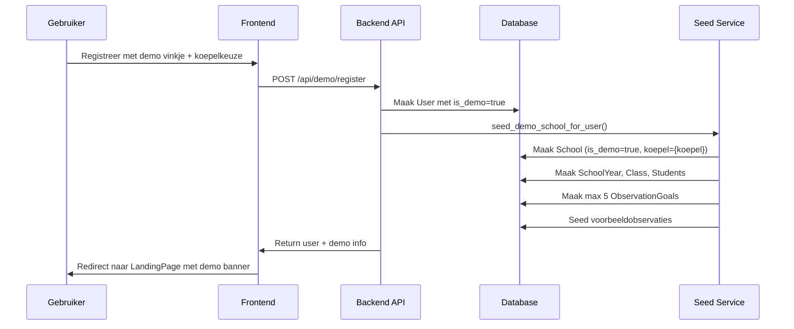
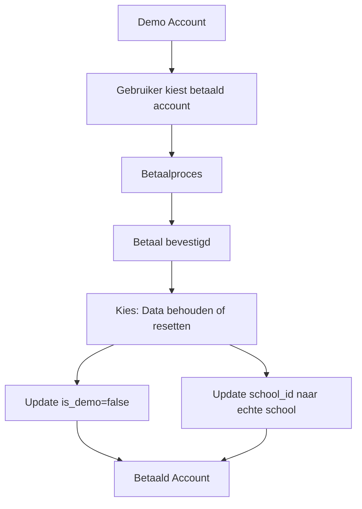

# Demo Functionaliteit - Individuele Demo School Per Gebruiker

## Overzicht

Deze documentatie beschrijft de architectuur en logica voor een demo functionaliteit waarbij elke gebruiker die een demo account aanmaakt, een eigen (individuele) demo school krijgt met realistische testdata. Deze demo school wordt gerefereerd aan een specifieke koepel (schoolkoepel/onderwijsnetwerk) en kan later worden omgezet naar een schoolgekoppelde account.

## Use Case
 
1. **Registratie**: Een bezoeker registreert een account en kiest een demo account
2. **Demo School Aanmaken**: Een unieke demo school wordt automatisch aangemaakt voor deze gebruiker met voorbeelddata (schooljaar, 3 klassen, 15 leerlingen in 3K, observaties)
3. **Verkennen**: De gebruiker kan de webapp verkennen met deze testdata
4. **Koppeling aan echte school**: Dezelfde account kan later worden gekoppeld aan een niet-demo school
5. **Demo school verwijderen**: Bij koppeling aan een echte school moet de demo school zeker worden gewist
6. **Reset**: De demo data kan worden gereset (automatisch 's nachts of manueel)

## Architectuur Componenten

### 1. Database Schema Aanpassingen

#### User Model (`backend/app/models/user.py`)

```python
# Nieuwe velden toe te voegen:
is_demo = Column(Boolean, default=False)
demo_expires_at = Column(DateTime, nullable=True)
demo_school_id = Column(Integer, ForeignKey("schools.id"), nullable=True)
```

#### School Model (`backend/app/models/school.py`)

```python
# Nieuwe velden toe te voegen:
is_demo = Column(Boolean, default=False)
koepel = Column(String, nullable=True)  # Bijv. "KOOPPEL1", "KOOPPEL2"
```

### 2. API Endpoints

#### Nieuwe Endpoints

| Endpoint | Methode | Beschrijving |
|----------|---------|--------------|
| `/api/demo/register` | POST | Registreer demo account met koepelkeuze |
| `/api/demo/reset` | POST | Reset demo data voor huidige gebruiker |
| `/api/demo/convert` | POST | Converteer demo account naar betaald account |

#### Aangepaste Endpoints

| Endpoint | Aanpassing |
|----------|------------|
| `/api/users` | Accepteert nu `is_demo` parameter |
| `/api/auth/me` | Inclusief `is_demo` en `demo_school_id` in response |

#### Schema Aanpassingen

**UserCreate Schema (`backend/app/schemas/user.py`)**
```python
# Nieuwe velden:
is_demo: bool = False
koepel: str | None = None
```

**UserResponse Schema (`backend/app/schemas/user.py`)**
```python
# Nieuwe velden:
is_demo: bool = False
demo_school_id: int | None = None
demo_expires_at: datetime | None = None
```

**Frontend UserResponse Interface (`frontend/src/services/auth.ts`)**
```typescript
export interface UserResponse {
  id: number
  email: string
  name: string
  is_active: boolean
  is_superuser: boolean
  is_pending: boolean
  school_id: number | null
  is_demo: boolean  // Nieuw
  demo_school_id: number | null  // Nieuw
}
```

### 3. Service Laag

#### DemoService (`backend/app/services/demo_service.py`)

```python
# Verantwoordelijkheden:
# - Aanmaken individuele demo school
# - Seeden van demo data gebaseerd op koepel
# - Reset logica voor demo data
# - Validatie van demo account beperkingen
```

### 4. Seed Script Uitbreiding

Het bestaande [`backend/scripts/seed.py`](../backend/scripts/seed.py) wordt uitgebreid met:

```python
def seed_demo_school_for_user(user_id: int, koepel: str):
    """
    Maak een individuele demo school aan voor een gebruiker.
    Gebruikt dezelfde logica als seed_school_and_admin maar met:
    - Unieke school naam (bijv. "Demo School - {user_id}")
    - Koepel-specifieke data seed
    - Beperkte observatiedoelen (max 5)
    """
```

#### Koepel Specifieke Data Sets

De demo data wordt gekoppeld aan een koepel (schoolkoepel/onderwijsnetwerk). Voorbeeld data sets:

| Koepel | Leerlingen | Observatiedoelen | Schooljaar |
|--------|------------|----------------|------------|
| KOOPPEL1 | 15 leerlingen (3K) | 5 basisdoelen | 2026-2027 |
| KOOPPEL2 | 12 leerlingen (2K) | 5 basisdoelen | 2026-2027 |

#### Standaard Demo Observatiedoelen (max 5)

Gebaseerd op [`backend/scripts/seed.py`](../backend/scripts/seed.py) regels 355-370:

1. **Wiskunde - Getallenkennis**
   - Rangtelwoorden (code: 2.1.GK3.5)
   - Telrij tot 20 (code: 2.1.GK3.1)
   - Aantallen tot 10 (code: 2.1.GK3.3)

2. **Wiskunde - Meetkunde**
   - Vormen herkennen (code: 2.1.GK3.7)

3. **Nederlands - Lezen**
   - Klanken herkennen (code: 2.1.GK3.2)
   - Woorden lezen (code: 2.1.GK3.2)

#### Demo Data Structuur

```
Demo School (is_demo=true, koepel={koepel})
├── SchoolYear: 2026-2027
│   └── Class: 3K
│       ├── 15 Students (Lena, Milan, Noor, etc.)
│       └── ObservationGoals (max 5)
│           ├── StudentObservations (voorbeeld data)
```

### 5. API Endpoint Specificaties

#### POST /api/demo/register

**Request Body:**
```json
{
  "name": "Jan Jansen",
  "email": "jan@example.com",
  "koepel": "KOOPPEL1"
}
```

**Response:**
```json
{
  "id": 123,
  "email": "jan@example.com",
  "name": "Jan Jansen",
  "is_active": true,
  "is_superuser": false,
  "is_pending": false,
  "school_id": 456,
  "is_demo": true,
  "demo_school_id": 456,
  "demo_expires_at": "2026-07-21T00:00:00Z"
}
```

#### POST /api/demo/reset

**Request:** (authenticated)
```http
POST /api/demo/reset
Authorization: Bearer {token}
```

**Response:**
```json
{
  "message": "Demo data gereset",
  "reset_at": "2026-06-21T22:00:00Z"
}
```

#### POST /api/demo/convert

**Request Body:**
```json
{
  "keep_data": true,
  "school_id": 789
}
```

## Data Flow



## Reset Implementatie Details

### Optie 1: Database Level Reset

Gebruik een aparte tabel voor demo data snapshots:

```sql
CREATE TABLE demo_data_snapshots (
    id SERIAL PRIMARY KEY,
    school_id INTEGER REFERENCES schools(id),
    snapshot_data JSONB,
    created_at TIMESTAMP DEFAULT NOW()
);
```

Bij registratie: snapshot maken van de seed data
Bij reset: snapshot herstellen

### Optie 2: Soft Delete + Restore

Markeer observaties als `is_demo_temporary` en herstel bij reset:

```python
# In StudentObservation model
is_demo_temporary = Column(Boolean, default=False)

# Reset query
db.query(StudentObservation).filter(
    StudentObservation.school_id == demo_school_id,
    StudentObservation.is_demo_temporary == True
).delete()
```

## Reset Strategieën

### Optie A: Automatisch Nightly Reset

**Implementatie**: PostgreSQL scheduled job of Celery beat

**Werkproces**:
1. Cron job draait 's nachts (02:00)
2. Zoekt alle demo schools met `is_demo=true`
3. Verwijdert observaties en observatiedoelen
4. Herstelt originele seed data
5. Behoudt de demo-gebruiker account

**Voordelen**:
- Consistente ervaring voor nieuwe demo gebruikers
- Geen data accretie

**Nadelen**:
- Complexere implementatie
- Mogelijk ongemaklijk voor actieve gebruikers

### Optie B: Manuele Reset met Beperking

**Implementatie**: Reset knop in UI + server-side validatie

**Werkproces**:
1. Gebruiker klikt op "Reset Demo Data" knop
2. Backend valideert: max 5 observatiedoelen mogen worden verwijderd
3. Verwijdert observaties en observatiedoelen
4. Herstelt seed data

**Voordelen**:
- Gebruiksvriendelijk
- Controle over wanneer reset plaatsvindt

**Nadelen**:
- Mogelijk vergetelijkheid over reset
- Minder consistent

### Aanbevolen: Hybride Aanpak

Combineer beide opties:
- Manuele reset knop beschikbaar
- Nightly reset als backup (bijv. om de week)
- Beperk demo account geldigheid (30-60 dagen)

## Beperkingen om Misbruik te Voorkomen

### Technische Beperkingen

| Beperking | Waarde | Reden |
|-----------|--------|-------|
| Max observatiedoelen | 5 | Voorkomt overload, forceert focus |
| Max observaties per doel | 20 | Beperkt data volume |
| Account vervaldatum | 30 dagen | Automatische opruiming |
| Geen export functionaliteit | - | Voorkomt data diefstahl |
| Geen delen functionaliteit | - | Voorkomt externe distributie |

### UI Beperkingen

- Watermark "DEMO" op alle rapportages
- Banner op elke pagina: "Dit is een demo account"
- Geen toegang tot admin functies
- Beperkte schoolinstellingen

## Conversie naar Betaald Account

### Flow



### Opties voor Data Behoud

1. **Data behouden**: Demo school blijft bestaan, wordt gekoppeld aan echte school
2. **Data resetten**: Nieuwe lege school, oude demo data wordt verwijderd
3. **Data migreren**: Observaties migreren naar bestaande school (complexer)

## Frontend Aanpassingen

### LoginPage (`frontend/src/pages/LoginPage.tsx`)

Nieuwe optie: "Demo account aanmaken" link

### LandingPage (`frontend/src/pages/LandingPage.tsx`)

Voor demo accounts:
```tsx
{demoInfo && (
  <div className="demo-banner">
    <h2>Demo Account</h2>
    <p>Je gebruikt momenteel een demo account...</p>
    <button onClick={handleReset}>Reset Demo Data</button>
    <button onClick={handleConvert}>Converteer naar betaald account</button>
  </div>
)}
```

### Nieuwe DemoRegistratiePage

Formulier met:
- Naam, email
- Koepel keuze (dropdown)
- Demo account checkbox
- Acceptatie voorwaarden

## Security Overwegingen

1. **Rate Limiting**: Max 1 demo account per IP per dag
2. **Email Validatie**: Verplichte email verificatie
3. **Data Isolatie**: Demo data volledig gescheiden van productie data
4. **Monitoring**: Log demo account activiteit voor anomaly detectie

## Implementatie Roadmap

### Fase 1: Basis Structuur
- [ ] Database schema aanpassingen
- [ ] DemoService implementeren
- [ ] API endpoints voor demo registratie

### Fase 2: Data Seeding
- [ ] Koepel-specifieke seed logica
- [ ] Max 5 observatiedoelen beperking
- [ ] Voorbeeldobservaties seeden

### Fase 3: Reset Functionaliteit
- [ ] Manuele reset endpoint
- [ ] Nightly reset job (optioneel)
- [ ] UI reset knop

### Fase 4: Conversie Flow
- [ ] Betaalintegratie (extern)
- [ ] Data migratie logica
- [ ] Account conversie endpoint

### Fase 5: UX Verfijning
- [ ] Demo banner op alle pagina's
- [ ] LandingPage aanpassingen
- [ ] Help text en tooltips

## Open Vragen

1. **Koepel keuze**: Welke koepels moeten beschikbaar zijn?
2. **Data volume**: Hoeveel leerlingen/students per demo school?
3. **Reset frequentie**: Dagelijks, wekelijks, of alleen manueel?
4. **Betaalprovider**: Welke betaalprovider integreren?
5. **Communicatie**: Hoe informeren over demo vervaldatum?

## Alternatieve Reset Implementaties

### Alternatief 1: Shadow Table Pattern

Gebruik aparte tabellen voor demo data die kunnen worden gedropt/hergemaakt:

```sql
-- Demo-specifieke tabellen
CREATE TABLE demo_observation_goals (
    LIKE observation_goals INCLUDING ALL
);
CREATE TABLE demo_student_observations (
    LIKE student_observations INCLUDING ALL
);
```

### Alternatief 2: Data Versioning

Sla de originele seed data op als "versie 1" en herstel bij reset:

```python
# In observatie doelen
original_state = Column(JSON, nullable=True)  # Sla initiele state op

# Bij reset
def reset_demo_data(school_id: int):
    # Herstel van original_state
    pass
```

## Referenties

- Bestaand seed script: [`backend/scripts/seed.py`](../backend/scripts/seed.py)
- User model: [`backend/app/models/user.py`](../backend/app/models/user.py)
- School model: [`backend/app/models/school.py`](../backend/app/models/school.py)
- Auth service: [`backend/app/services/auth_service.py`](../backend/app/services/auth_service.py)
- Frontend auth: [`frontend/src/services/auth.ts`](../frontend/src/services/auth.ts)